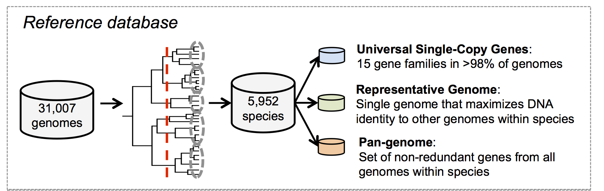
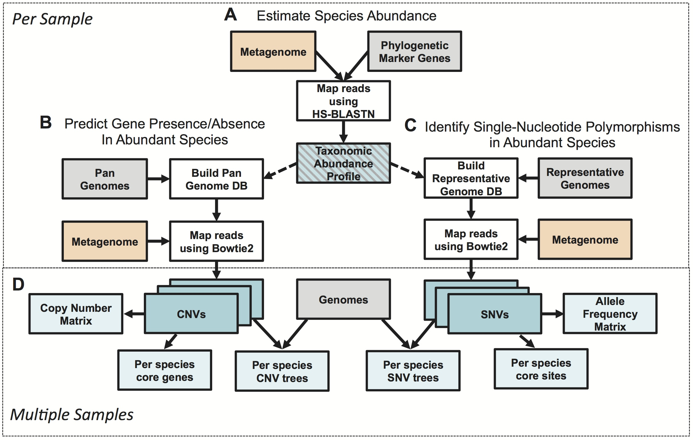

# Overview

MIDAS is an integrated pipeline that leverages >30,000 reference genomes to estimate bacterial species abundance and strain-level genomic variation, including gene content and SNPs, from shotgun metagnomes. Given a metagenome, MIDAS produces the following:

* Species relative abundance profile
* Nucleotide variants in abundant species (e.g. >10x depth)
* Gene copy number variants in abundant species (e.g. >5x depth)

## How it works
  
<b>Reference database:</b> MIDAS relies on a reference database that contains 31,007 bacterial genomes. These genomes were hierarchically clustered into 5,952 species groups based on the sequence similarity between genomes at 30 universal genes. For each species, we extracted three genomic features: 15 universal-single-copy genes, a representative genome, and a pan-genome [...read more](ref_db.md).

  

<b>Metagenomic species profiling:</b> Given a metagenome, MIDAS uses HS-BLASTN to align reads against the database of universal-single-copy genes from all species in the reference database. Mapped reads are used to estimate the genome-coverage and relative abundance of 5,952 genome-clusters [...read more](species.md).

<b>Metagenomic SNP calling:</b> For species with sufficient depth (e.g. >10x), SNP calling is performed. First, a local bowtie2 database is contructed that contains one representative genome per abundant species. Reads are globally aligned to the genome database using Bowtie2. Mapped reads are used to identify variants and estimate allele frequencies.

<b>Metagenomic pan-genome profiling:</b> For species with sufficient depth (e.g. >5x), pan-genome profiling is performed. First, a local bowtie2 database is contructed that contains one pan-genome per abundant species. Reads are globally aligned to the genome database using Bowtie2. Mapped reads are used to infer gene copy number and gene presence/absence.

  

## Limitations
Before going through the trouble of installing and running the program, it's worth considering these things:

1. MIDAS requires at least one sequenced genome to quantify the abundance or population genomics of a species. Most species from the human microbiome meet this critereon, but species from other communities may not. For poorly characterized communities, try [building your own reference database](build_db.md).
2. MIDAS does NOT estimate the abundance of strains. It simply identifies species abundance and strain-level genomic variants (SNPs and CNVs). 
3. Strain-level phylogenetic trees are based on consensus alleles. This means that there will be only one leaf per species per sample. These trees are accurate when within-sample intra-species heterogentity is low (i.e. one dominant strain) but may not be accurate when there is a mixture of two or more common strains. You can use SNPs to quantify the level of within-sample heterogeneity.
4. The pan-genomes of many species are imcomplete. If you're concerned about this, try [building your own reference database](build_db.md).
5. The default MIDAS database is 17Gb and requires 34Gb of free space to decompress

## Examples
  
<b>Comparative genomics of <i>Bacteroides ovatus</i> strains across host microbiomes</b> 
 <b>A)</b> Presence or absence of genes in the <i>Bacteroides ovatus</i> pangenome across human faecal metagenomes. Column colors indicate whether a gene is core (blue; occurs in >95% of samples), auxiliary (red; occurs in 1-95% of samples ), or absent (green; occurs in < 1% of samples). <b>B)</b> Gene set enrichment analysis identifies functions overrepresented in the core genome, auxiliary genome, and genes that only occur in reference genomes.

## Next step
[Install or update software](docs/install.md) 
