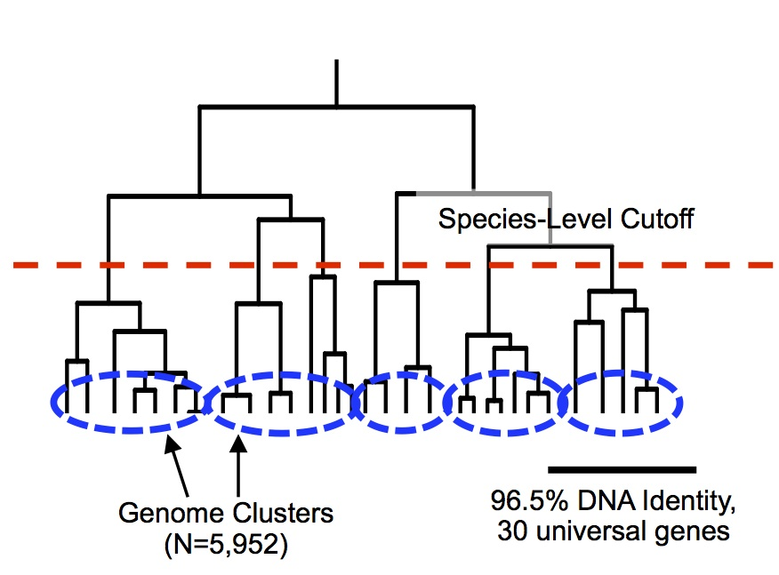
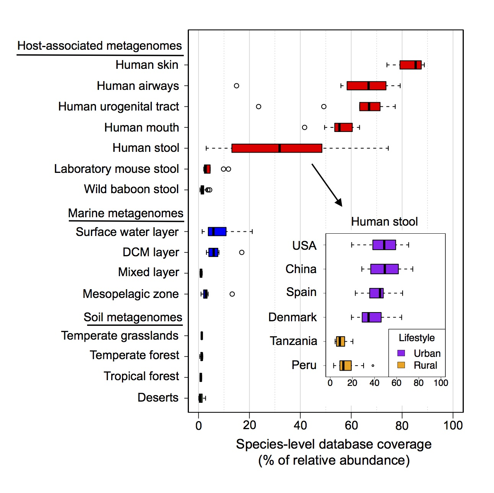

# MIDAS reference database

## Identification of bacterial species
Contains 31,007 bacterial reference genomes clustered into 5,952 species groups. Species groups are based on 96.5% sequence identity across 30 universal marker genes. These groups correspond to the gold-standard definition of bacterial species based on 95% genome-wide average nucleotide identity (ANI):
   
    
Each genome-cluster was annotated according to the consensus (i.e., most common) Latin name of named genomes within the cluster. 18% of genomes disagree with the consensus name. 47% of the discrepancies are due to genomes that have no species name (ex: Streptococcus unclassified). 29% are due to genomes that agree with the consensus name, but are split from a larger genome-cluster with the same Latin name. 24% of discrepancies are because the name of the genome differs from the consensus name (ex: Prevotella copri strain1234 assigned to genome-cluster Bacteroides ovatus):
   
      
## Genomic database construction

**Marker-genes**

* Database of universal-single-copy genes (15 gene families) 
* Metagenomic reads are initially mapped to these genes estimate the relative abundance of all species in the reference database

**Representative genome** 

* Individual reference genome per species
* Genome was picked in order to minimize marker-gene distance to other genomes clustered in the same species
* Metagenomic reads are mapped to the represenative genome to identify single-nucleotide-polymorphisms

**Pan-genome**

* The set of non-redundant genes (99% DNA identity) across all genomes within species
* Metagenomic reads are mapped to pan-genome database to determine the gene-content of strains in a sample
* Genes are also clustered at other percent identity thresholds (75%, 80%, 85%, 90%, 95%)
* Gene clustering was performed with USEARCH

## Database coverage across biomes

Species-level coverage of the MIDAS reference database across metagenomes from host-associated, marine, and terrestrial environments. Coverage is defined as the percent (0 to 100%) of genomes from cellular organisms in a community that have a sequenced representative at the species level in the reference database. Inset panel shows the distribution of database coverage across human stool metagenomes from six countries and two host lifestyles:
  

## Download the reference database
Download the MIDAS reference database of marker genes, pangenomes, and representative genomes:  
`python MIDAS/scripts/download_ref_db.py`  
* This may take several minutes to several hours, depending on your internet speed
* The entire database requires 35 GB of free space to download and decompress
* Once decompressed, it takes 17G of free space
* Database will be downloaded to MIDAS/ref_db
* See MIDAS/ref_db/README for more information
* The database can also be accessed at: [http://lighthouse.ucsf.edu/MIDAS](http://lighthouse.ucsf.edu/MIDAS) 

## Next step
[Run MIDAS on an example dataset] (tutorial.md)
