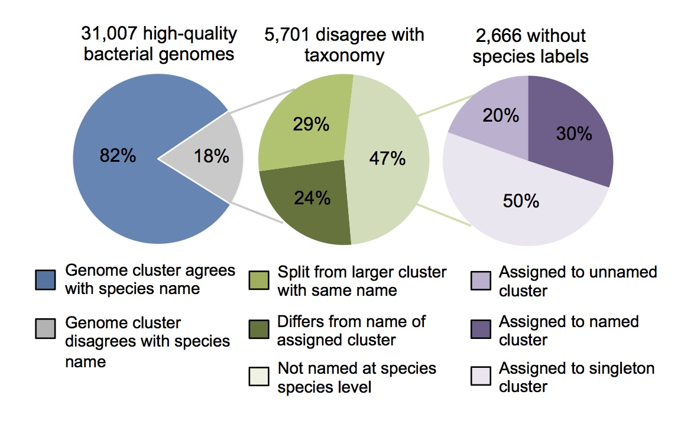

## CAUTION:  This verbatim copy of the original [MIDAS tool](https://github.com/snayfach/MIDAS) documentation is OUT OF DATE for the MIDAS-IGGdb update, and only included as a temporary reference during construction of MIDAS-IGGdb.

# MIDAS reference database
Description of how the MIDAS database was constructed, how the species groups compare to annotated Latin names, how well the database works in different types of environments, and how to download it.

## Install reference database

#### Step 1. download default database 
Download the latest version from your browser:   
[http://lighthouse.ucsf.edu/MIDAS/midas\_db_v1.2.tar.gz](http://lighthouse.ucsf.edu/MIDAS/midas_db_v1.2.tar.gz)

Or, download from the command line:   
on Unix: `wget http://lighthouse.ucsf.edu/MIDAS/midas_db_v1.2.tar.gz`  
on OSX: `curl http://lighthouse.ucsf.edu/MIDAS/midas_db_v1.2.tar.gz > midas_db_v1.2.tar.gz`

* This may take several minutes to several hours, depending on your internet speed
* The entire database requires 36 GB of free space to download and decompress
* Once decompressed, it takes 18G of free space
* See `midas_db_v1.2/README` for more information

#### Step 2. unpack tarball
`tar -zxvf midas_db_v1.2.tar.gz`  

#### Step 3. create MIDAS_DB environmental variable
The MIDAS_DB variable tells MIDAS where the reference database is located:   
`export MIDAS_DB=midas_db_v1.2`

Alternatively, you can manually specify the database location when you run MIDAS:  
`run_midas.py species outdir -d midas_db_v1.2 [options]`

## Build custom database
Alternatively, you can build a custom database with your own genome sequences [read more](build_db.md)

## Details about the default database

### Identification of bacterial species
Contains 31,007 bacterial reference genomes clustered into 5,952 species groups. Species groups are based on 96.5% sequence identity across 30 universal marker genes. These groups correspond to the gold-standard definition of bacterial species based on 95% genome-wide average nucleotide identity (ANI):  
   
    
Each genome-cluster was annotated according to the consensus (i.e., most common) Latin name of named genomes within the cluster. 18% of genomes disagree with the consensus name. 47% of the discrepancies are due to genomes that have no species name (ex: Streptococcus unclassified). 29% are due to genomes that agree with the consensus name, but are split from a larger genome-cluster with the same Latin name. 24% of discrepancies are because the name of the genome differs from the consensus name (ex: Prevotella copri strain1234 assigned to genome-cluster Bacteroides ovatus):  
   
      
### Genomic database construction

<b>Marker-genes</b>

* Database of universal-single-copy genes (15 gene families) 
* Metagenomic reads are initially mapped to these genes estimate the relative abundance of all species in the reference database

<b>Representative genome</b>

* Individual reference genome per species
* Genome was picked in order to minimize marker-gene distance to other genomes clustered in the same species
* Metagenomic reads are mapped to the represenative genome to identify single-nucleotide-polymorphisms

<b>Pan-genome</b>

* The set of non-redundant genes (99% DNA identity) across all genomes within each species
* Mapping between 99% identity gene clusters and gene clusters at lower % identity clustering thresholds (95, 90, 85, 80, and 75)
* Metagenomic reads are initially mapped to centroid gene sequences from 99% gene families
* Reads can be easily aggregated into gene clusters at lower % identity clustering thresholds
* Mapped reads are used to determine the gene content of strains in a sample
* Gene clustering was performed with USEARCH

### Database coverage across biomes

Species-level coverage of the MIDAS reference database was estimated across metagenomes from host-associated, marine, and terrestrial environments. Coverage is defined as the percent (0 to 100%) of genomes from cellular organisms in a community that have a sequenced representative at the species level in the reference database. Inset panel shows the distribution of database coverage across human stool metagenomes from six countries and two host lifestyles:  
  
